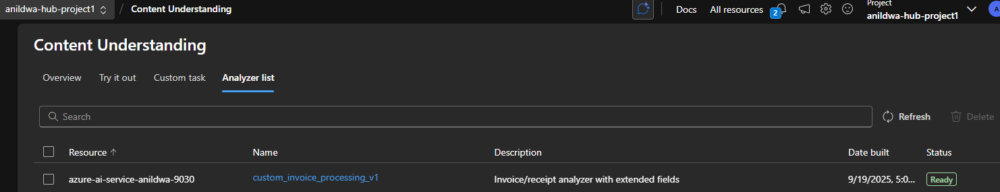

## Invoice Extraction with Azure AI Content Understanding service

### Preqrequisites

1. Azure AI Foundry project created with Content Understanding service enabled. Follow the instructions [here](https://learn.microsoft.com/en-us/azure/ai-foundry/how-to/create-projects?tabs=ai-foundry) to create the resource.
2. Create a Hub based Azure AI Foundry project. Follow the instructions [here](https://learn.microsoft.com/en-us/azure/ai-foundry/concepts/ai-resources) to create a Hub based project.
3. Azure AI Foundry project should be connected to an Azure Blob Storage account. Follow the instructions [here](https://learn.microsoft.com/en-us/azure/ai-foundry/how-to/connections-add) to connect the storage account.
4. Azure AI Foundry project endpoint and subscription key. You can find these in the Azure portal on the Content Understanding resource page.
5. Upload invoice documents to the connected Azure Blob Storage account using Azure Portal, Azure Storage Explorer, or any other tool of your choice.
6. Python 3.11 or later installed on your machine.


### Install

```bash
cd invoice_extraction
python -m venv .venv
source .venv/bin/activate  # On Windows use `.venv\Scripts\activate`
pip install -r requirements.txt
```


### Analyzer schema creation

1. Open the `custom_schema.json` file and modify it as needed to fit your invoice extraction requirements.
2. Save the changes to the `custom_schema.json` file.

### Create or update the custom analyzer

Rename the `.env.example` file to `.env` and update the environment variables with your Azure Content Understanding service details.
Update the `ANALYZER_ID` variable in the `create_custom_analyzer.py` script if needed.

```bash
python create_custom_analyzer.py
```

This script will create or update the custom analyzer using the schema defined in `custom_schema.json`.

### Verify the analyzer
You can verify that the analyzer was created or updated successfully by checking the output of the script or by using the Azure portal to view the analyzers in your Content Understanding resource.



### Analyze invoice documents
Collect a few invoice document URLs from the connected Azure Blob Storage account and update the `file_urls` list in the `invoice_processing.py` script.
This script can be updated to process multiple documents as needed. This is not implemented in this sample.
Update the `ANALYZER_ID` variable in the `invoice_processing.py` script if needed.

```bash
python invoice_processing.py
```
This script will take a few seconds to complete.
This script will analyze the specified invoice document using the custom analyzer created earlier and create a json file in the invoice_processing_result folder with the extracted fields.

### View the results

Open the raw_filename.json file in the invoice_processing_result folder to see the extracted fields from the invoice document.

