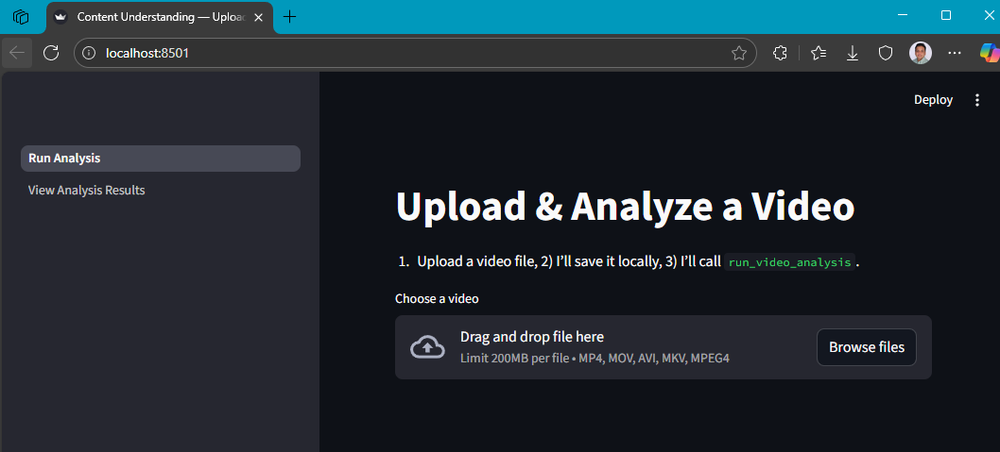
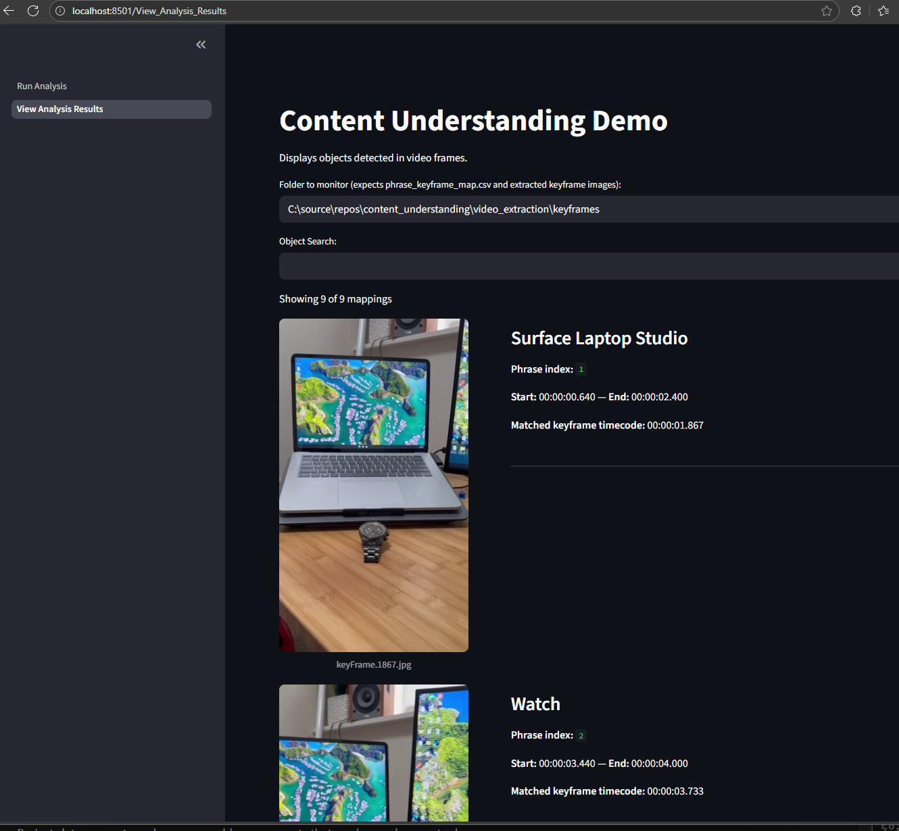
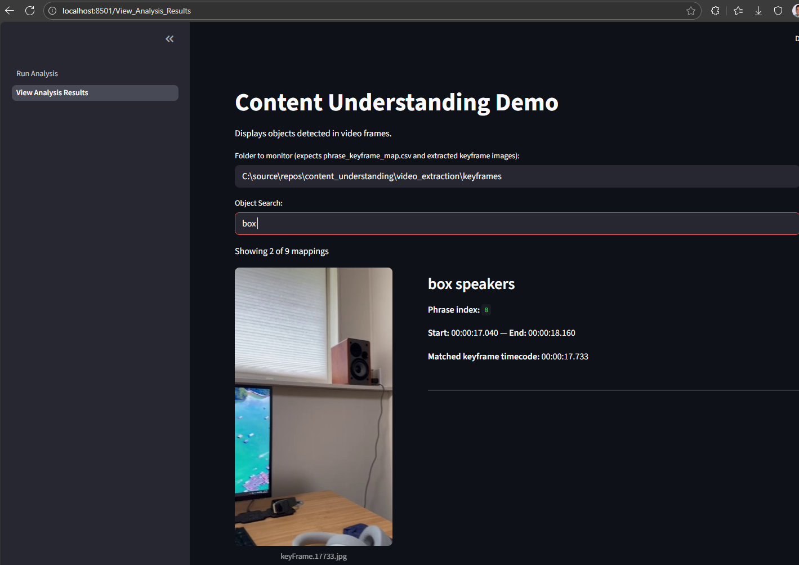

## Extract products from recorded video file
Uses recorded video file with narration to extract products mentioned in the video. 
The extracted products are then matched with the keyframes extracted from the video to create a product listing. 

# Prerequisites
1. Azure AI Foundry project created with Content Understanding service enabled. Follow the instructions [here](https://learn.microsoft.com/en-us/azure/ai-foundry/how-to/create-projects?tabs=ai-foundry) to create the resource.
2. Create a Hub based Azure AI Foundry project. Follow the instructions [here](https://learn.microsoft.com/en-us/azure/ai-foundry/concepts/ai-resources) to create a Hub based project.
3. Azure AI Foundry project should be connected to an Azure Blob Storage account. Follow the instructions [here](https://learn.microsoft.com/en-us/azure/ai-foundry/how-to/connections-add) to connect the storage account.
4. Azure AI Foundry project endpoint and subscription key. You can find these in the Azure portal on the Content Understanding resource page.
5. Sample video file (e.g. sample_video.mp4) with narration that mentions products.
6. Python 3.11 or later installed on your machine.


## Install dependencies

```
cd video_extraction
python -m venv .venv   
source .venv/bin/activate  # On Windows use `.venv\Scripts\activate`
pip install -r requirements.txt
```


## Run the app

```
streamlit run Run_Analysis.py
```
This will open a browser window with the Streamlit app.


## View the results
Upload the sample video file using the Streamlit app to see the extracted products and keyframes.
The extracted products and keyframes will be displayed in the Streamlit app. 






### Search Products

